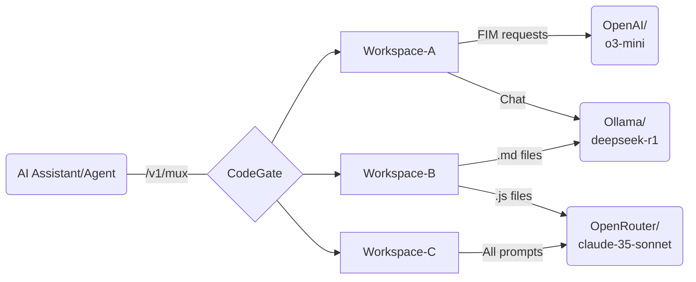

import useBaseUrl from '@docusaurus/useBaseUrl';
import ThemedImage from '@theme/ThemedImage';

## Overview

_Model muxing_ (or multiplexing), allows you to configure your AI assistant once
and use [CodeGate workspaces](./workspaces.mdx) to switch between LLM providers
and models without reconfiguring your development environment. This feature is
especially useful when you're working on multiple projects or tasks that require
different AI models.

In each of your CodeGate workspaces, you can select the AI provider and model
combinations to use, even dynamically switching the active model based on the
request type and file types found in your prompt. Then, configure your AI coding
tool to use the CodeGate muxing endpoint `http://localhost:8989/v1/mux` as an
OpenAI-compatible API provider.

To change the model(s) currently in use, simply switch your active CodeGate
workspace.

## Use cases

- You have a project that requires a specific model for a particular task, but
  you also need to switch between different models during the course of your
  work.
- You're working in a monorepo with several different languages/file types and
  want to dynamically switch to an optimal model as you move between different
  parts of the codebase.
- You want to experiment with different LLM providers and models without having
  to reconfigure your AI assistant/agent every time you switch.
- Your AI coding assistant doesn't support a particular provider or model that
  you want to use. CodeGate's muxing provides an OpenAI-compatible abstraction
  layer.
- You're working on a sensitive project and want to use a local model, but still
  have the flexibility to switch to hosted models for other work.
- You want to control your LLM provider spend by using lower-cost models for
  some tasks that don't require the power of more advanced (and expensive)
  reasoning models.

## Configure muxing

To use muxing with your AI coding assistant, you need to add one or more AI
providers to CodeGate, then select the model(s) you want to use on a workspace.

CodeGate supports the following LLM providers for muxing:

- Anthropic
- llama.cpp
- LM Studio
- Ollama
- OpenAI (and compatible APIs)
- OpenRouter
- vLLM

### Add a provider

1. In the [CodeGate dashboard](http://localhost:9090), open the **Providers**
   page from the **Settings** menu.
1. Click **Add Provider**.
1. Enter a display name for the provider, then select the type from the
   drop-down list. The default endpoint and authentication type are filled in
   automatically.
1. If you are using a non-default endpoint, update the **Endpoint** value.
1. Optionally, add a **Description** for the provider.
1. If the provider requires authentication, select the **API Key**
   authentication option and enter your key.

When you save the settings, CodeGate connects to the provider to retrieve the
available models.

:::note

For locally-hosted models, you must use `http://host.docker.internal` instead of
`http://localhost`

:::

### Configure workspace models

Open the settings of one of your [workspaces](./workspaces.mdx) from the
workspace selection menu or the
[Manage Workspaces](http://localhost:9090/workspaces) screen.

In the **Model Muxing** section, select the default ("catch-all") model to use
with the workspace.

To assign a different model based on request type or filename, click **Add
Filter**.

In the **Request Type** column, select the type of prompt to match:

- `FIM & Chat` matches all prompt types
- `FIM` matches fill-in-the-middle (completion) requests
- `Chat` matches chat prompts

In the **Filter by** column, enter a file name or extension string to match.
This is an exact or `endswith` match, wildcards are not supported. For example,
to match Python files, enter `.py`.

Finally, select the model to use for prompts that match the rule.

Filter rules are evaluated top-down. CodeGate selects the active model for a
request using the first matching rule. If the prompt contains multiple files in
context, the first rule that matches _any_ of the files is used. If no filter is
matched, the catch-all rule applies.

#### Example configuration

<ThemedImage
  alt='An example showing several muxing rules for different file types'
  sources={{
    light: useBaseUrl('/img/features/muxing-rules-light.webp'),
    dark: useBaseUrl('/img/features/muxing-rules-dark.webp'),
  }}
  title='Example muxing rules'
  width={'800px'}
/>
_An example showing several muxing rules for different file types_

Breaking down the above example:

- Markdown files (`.md`) use the gpt-4o-mini model from the OpenAI provider for
  all request types.
- Chat prompts for JavaScript files (`.js`, but NOT `.jsx`) use
  anthropic/claude-3.7-sonnet via OpenRouter.
- FIM requests for all files (except `.md` since it's higher in the list) use
  Ollama with the qwen2.5-coder:1.5b model.
- All other requests use anthropic/claude-3.5-sonnet via OpenRouter.
- A request containing both a JavaScript and Markdown file will match the `.md`
  rule first and use OpenAI.

You can validate which provider was used for a given request by checking the
**conversation summary** in the CodeGate dashboard.

### Manage existing providers

To edit a provider's settings, click the Manage button next to the provider in
the list. For providers that require authentication, you can leave the API key
field blank to preserve the current value.

To delete a provider, click the trash icon next to it. If this provider was in
use by any workspaces, you will need to update their settings to choose a
different provider/model.

### Refresh available models

To refresh the list of models available from a provider, in the Providers list,
click the Manage button next to the provider to refresh, then save it without
making any changes.

## Configure your client

Configure the OpenAI-compatible API base URL of your AI coding assistant/agent
to `http://localhost:8989/v1/mux`. If your client requires a model name and/or
API key, you can enter any values since CodeGate manages the model selection and
authentication.

For specific instructions, see the
[integration guide](../integrations/index.mdx) for your client.
