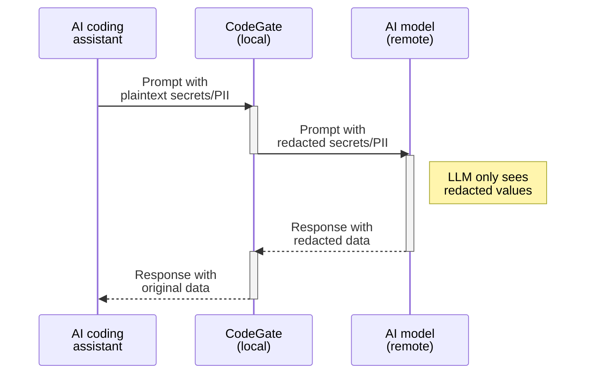

## What's the risk?

As you interact with an AI coding assistant, sensitive data like passwords
access tokens, and even personally identifiable information (PII) can be
unintentionally exposed to third-party providers through the code and files you
share as context. Besides the privacy and regulatory implications of exposing
this information, it may become part of the AI model's training data and
potentially be exposed to future users.

## How CodeGate helps

CodeGate helps you protect sensitive information from being accidentally exposed
to AI models and third-party AI provider systems by redacting detected secrets
and PII found in your prompts.

## How it works

CodeGate automatically scans all prompts for secrets and PII. This happens
transparently without requiring a specific prompt. Without interrupting your
development flow, CodeGate protects your data by encrypting secrets and
anonymizing PII. These changes are made before the prompt is sent to the LLM and
are restored when the result is returned to your machine.

When a secret or PII is detected, CodeGate adds a message to the LLM's output
and an alert is recorded in the [dashboard](../how-to/dashboard.md) (PII alerts
in the dashboard are coming soon).

:::info

Since CodeGate runs locally, your secrets never leave your system unprotected.

:::

### Secrets encryption

CodeGate uses pattern matching to detect secrets such as:

- API keys and tokens
- Private keys and certificates
- Database credentials
- SSH keys
- Cloud provider credentials
- ...and more - see the
  [signatures file](https://github.com/stacklok/codegate/blob/main/signatures.yaml)
  in the project repo

CodeGate transparently encrypts secrets before sending the prompt to the LLM.
This is performed on the fly using AES256-GCM encryption with a temporary
per-session key. When the LLM returns a response, CodeGate decrypts the secret
before delivering it to your coding assistant, then securely erases the
temporary key from memory.

### PII redaction

CodeGate scans for common types of PII like:

- Email addresses
- Phone numbers
- Government identification numbers
- Credit card numbers
- Bank accounts and crypto wallet IDs

CodeGate anonymizes PII by replacing each string with a unique identifier before
sending the prompt to the LLM. This way, CodeGate protects your sensitive data
without blocking your development flow. When the LLM returns a response,
CodeGate matches up the identifier and replaces it with the original value.
