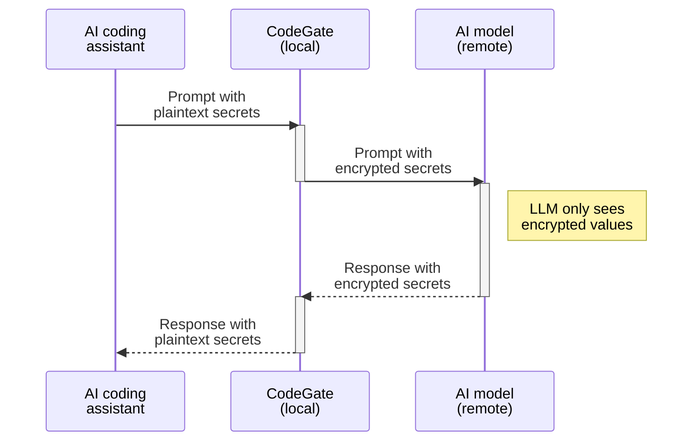

## What's the risk?

As you interact with an AI coding assistant, sensitive data like passwords and
access tokens can be unintentionally exposed to third-party providers through
the code snippets and files you share as context. These secrets may become part
of the training data used to improve the AI model and potentially be exposed to
other users.

## How CodeGate helps

CodeGate helps you protect sensitive information from being accidentally exposed
to AI models and third-party AI provider systems by redacting detected secrets
from your prompts using encryption.

## How it works

CodeGate automatically scans all prompts for secrets such as:

- API keys and tokens
- Private keys and certificates
- Database credentials
- SSH keys
- Cloud provider credentials

This scan happens transparently without requiring a specific prompt.

:::info

Since CodeGate runs locally, your secrets never leave your system unprotected.

:::

CodeGate transparently encrypts secrets before sending the prompt to the LLM.
This way, CodeGate protects your sensitive data without blocking your
development flow. This is performed on the fly using AES256-GCM encryption with
a temporary per-session key that is securely erased from memory after the
response is delivered to your plugin.

