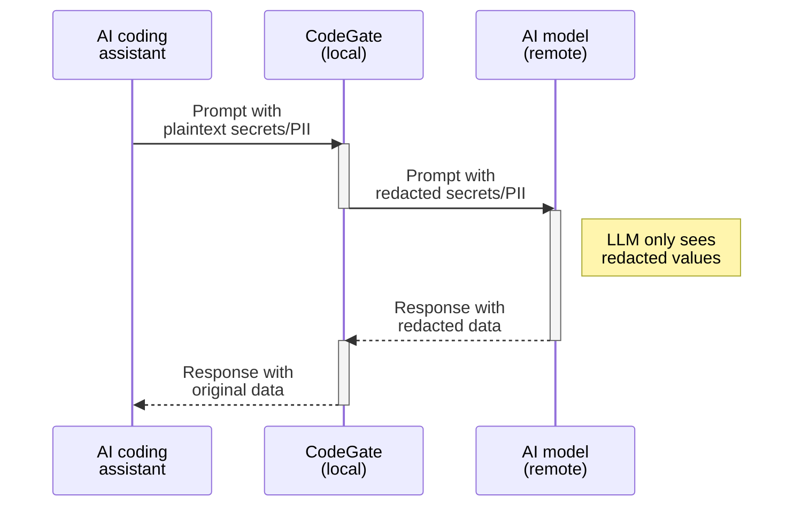

## What's the risk?

As you interact with an AI coding assistant, sensitive data like passwords
access tokens, and even personally identifiable information (PII) can be
unintentionally exposed to third-party providers through the code and files you
share as context. Besides the privacy and regulatory implications of exposing
this information, it may become part of the AI model's training data and
potentially be exposed to future users.

## How CodeGate helps

CodeGate helps you protect sensitive information from being accidentally exposed
to AI models and third-party AI provider systems by redacting detected secrets
and PII found in your prompts.

## How it works

CodeGate automatically scans all prompts for secrets and PII. This happens
transparently without requiring a specific prompt. Without interrupting your
development flow, CodeGate protects your data by redacting secrets and
anonymizing PII. These changes are made before the prompt is sent to the LLM and
are restored when the result is returned to your machine.

When a secret or PII is detected, CodeGate adds a message to the LLM's output
and an alert is recorded in the [dashboard](../how-to/dashboard.md).

:::info

Since CodeGate runs locally, your secrets never leave your system unprotected.

:::

CodeGate redacts secrets and anonymizes PII by replacing each string with a
unique identifier on the fly, before sending the prompt to the LLM. This way,
CodeGate protects your sensitive data without blocking your development flow.
When the LLM returns a response, CodeGate matches up the identifier and replaces
it with the original value.

### Secrets filtering

CodeGate uses pattern matching to detect secrets like:

- API keys and tokens
- Cloud provider credentials
- Database credentials
- Private keys and certificates
- SSH keys

For the full list of detected patterns, see the
[signatures file](https://github.com/stacklok/codegate/blob/main/signatures.yaml)
in the project repo.

### PII redaction

CodeGate scans for common types of PII including:

- Email addresses
- Phone numbers
- Government identification numbers
- Credit card numbers
- Bank accounts and crypto wallet IDs
