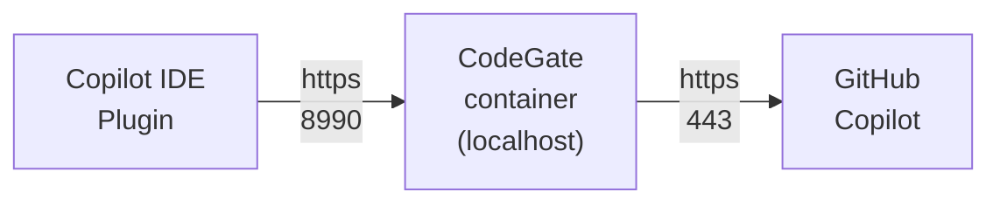

import Tabs from '@theme/Tabs';
import TabItem from '@theme/TabItem';

[GitHub Copilot](https://github.com/features/copilot) is an AI coding assistant
developed by GitHub and OpenAI. The Copilot plugin works with Visual Studio Code
(VS Code). Support for JetBrains is
[coming soon](https://github.com/stacklok/codegate/issues/383).

:::note

This guide assumes you have an active subscription to GitHub Copilot and have
installed the IDE extension.

:::

CodeGate works as a secure HTTP proxy to intercept and modify traffic between
GitHub Copilot and your IDE.



## Launch parameters

Several additional Docker parameters are required for Copilot support when you
launch CodeGate. If already have CodeGate running, remove the existing container
first with `docker stop codegate && docker rm codegate`.

1. The CodeGate HTTP proxy port (8990) must be mapped to your host along with
   the CodeGate API and UI ports.\
   Add `-p 8990:8990` to your `docker run` command.

1. CodeGate generates a self-signed Certificate Authority (CA) at startup which
   is used to maintain a secure end-to-end connection with Copilot.

   To prevent the certificate from changing on each restart, launch CodeGate
   with a persistent data volume. To do this, add a `--mount` parameter to your
   `docker run` command:

   `--mount type=volume,src=codegate_volume,dst=/app/codegate_volume`

This example binds the HTTP proxy port to the default 8990 on your host and
creates a volume named `codegate_volume` mounted to `/app/codegate_volume`
inside the container:

<Tabs groupId="os">
<TabItem value="macos" label="macOS / Linux" default>
```bash {2-3}
docker run --name codegate -d -p 8989:8989 -p 9090:9090 \
  -p 8990:8990 \
  --mount type=volume,src=codegate_volume,dst=/app/codegate_volume \
  --restart unless-stopped ghcr.io/stacklok/codegate:latest
```
</TabItem>
<TabItem value="windows" label="Windows (PowerShell)">
```shell {2-3}
docker run --name codegate -d -p 8989:8989 -p 9090:9090 `
  -p 8990:8990 `
  --mount type=volume,src=codegate_volume,dst=/app/codegate_volume `
  --restart unless-stopped ghcr.io/stacklok/codegate:latest
```

</TabItem>
</Tabs>

## Trust the CodeGate CA certificate

To establish a secure end-to-end connection between your IDE, CodeGate, and the
Copilot service, you need to add CodeGate's CA certificate to your trusted root
certificates. Decrypted traffic stays on your local machine and never leaves the
CodeGate container unencrypted.

<details>
<summary>More about certificate security</summary>

<h3 id='#is-this-certificate-safe'>
  Is this certificate safe to install on my machine?
</h3>

**Local-only:** CodeGate runs entirely on your machine within an isolated
container, ensuring all data processing stays local without any external
transmissions.

**Secure certificate handling:** This custom CA is locally generated and
managed. CodeGate developers have no access to it.

**No external communications:** CodeGate is designed with no capability to call
home or communicate with external servers, outside of those requested by the IDE
or Agent.

<h3 id='#key-security-features'>Key security features</h3>

**Per-domain certificate generation**

Instead of using wildcard certificates, CodeGate generates a unique certificate
for each domain. This approach minimizes security risks by limiting the impact
of any single certificate compromise.

**High-strength encryption with 4096-bit RSA keys**

CodeGate utilizes 4096-bit RSA keys for certificate authority operations,
providing enhanced security compared to standard 2048-bit keys. The increased
key length significantly reduces the risk of brute-force attacks, ensuring
long-term protection for your data. To balance performance, 2048-bit keys are
used for server certificates.

**Secure SSL/TLS configuration**

CodeGate's SSL context is configured to enforce the latest security standards,
including strong cipher suites and disabling outdated protocols. This ensures
secure and efficient encrypted communications.

**Certificate caching and management**

Certificates are cached efficiently to optimize performance without compromising
security. Additionally, mechanisms are in place to manage certificate lifecycle
and prevent resource exhaustion.

</details>

### Install certificate from the UI

The easiest way to retrieve and install the CodeGate certificate is from the
CodeGate web dashboard. Open the CodeGate dashboard in your browser:
http://localhost:9090

From the **Certificates** menu choose **Download**, then click the **Download
Certificate** button. Follow the OS-specific instructions on the page to import
the certificate to your trust store.

### Install certificate from the CLI

You can also install the CA certificate using the CLI.

:::note

Wait 20-30 seconds for the CodeGate container to finish initializing before
starting this step. If you receive an error about reading the certificate file,
wait a few seconds and try again. If this persists, check the CodeGate container
logs for errors.

:::

<Tabs groupId="os">
<TabItem value="macos" label="macOS" default>
```bash
docker cp codegate:/app/codegate_volume/certs/ca.crt ./codegate.crt
security add-trusted-cert -r trustRoot -k ~/Library/Keychains/login.keychain ./codegate.crt
```

Enter your password when prompted.

</TabItem>
<TabItem value="windows" label="Windows">
Run the following from a PowerShell prompt:

```powershell
docker cp codegate:/app/codegate_volume/certs/ca.crt .\codegate.crt
Import-Certificate -FilePath ".\codegate.crt" -CertStoreLocation Cert:\CurrentUser\Root
```

</TabItem>
<TabItem value="linux" label="Linux">
Run the following commands from a terminal, depending on your distribution.

Ubuntu/Debian based distributions:

```bash
docker cp codegate:/app/codegate_volume/certs/ca.crt ./codegate.crt
sudo cp ./codegate.crt /usr/local/share/ca-certificates/codegate.crt
sudo update-ca-certificates
```

RHEL/Fedora and other Enterprise Linux distributions:

```bash
docker cp codegate:/app/codegate_volume/certs/ca.crt ./codegate.crt
sudo cp ./codegate.crt /etc/pki/ca-trust/source/anchors/codegate.pem
sudo update-ca-trust
```

</TabItem>
</Tabs>

## Configure your IDE to proxy traffic through CodeGate

Finally, configure your IDE to use CodeGate as an HTTP proxy.

<Tabs groupId="ide">
<TabItem value="vscode" label="VS Code" default>
In VS Code, open the Command Palette (<kbd>⌘</kbd>+<kbd>Shift</kbd>+<kbd>P</kbd>
on macOS or <kbd>Ctrl</kbd>+<kbd>Shift</kbd>+<kbd>P</kbd> on Windows/Linux) and
search for the **Preferences: Open User Settings (JSON)** command.

Append the following settings to your configuration:

```json title="settings.json"
{
  // ... Existing settings ... //

  // Note: you may need to add a comma after the last line of your existing settings if not already present

  "http.proxy": "https://localhost:8990",
  "http.proxyStrictSSL": true,
  "http.proxySupport": "on",
  "http.systemCertificates": true,
  "github.copilot.advanced": {
    "debug.useNodeFetcher": true,
    "debug.useElectronFetcher": true,
    "debug.testOverrideProxyUrl": "https://localhost:8990",
    "debug.overrideProxyUrl": "https://localhost:8990"
  }
}
```

</TabItem>
<TabItem value="jetbrains" label="JetBrains" default>
Support for JetBrains is [coming soon](https://github.com/stacklok/codegate/issues/383).
</TabItem>
</Tabs>

## Verify configuration

To verify that you've successfully connected Copilot to CodeGate, open the
Copilot chat and type `codegate-version`. You should receive a response like
"CodeGate version 0.1.7".

Try asking CodeGate about a known malicious Python package:

```plain title="Copilot chat"
Tell me how to use the invokehttp package from PyPI
```

CodeGate responds with a warning and a link to the Stacklok Insight report about
this package:

```plain title="Copilot chat"
Warning: CodeGate detected one or more malicious, deprecated or archived packages.

 • invokehttp: https://www.insight.stacklok.com/report/pypi/invokehttp

The `invokehttp` package from PyPI has been identified as malicious and should
not be used. Please avoid using this package and consider using a trusted
alternative such as `requests` for making HTTP requests in Python.

Here is an example of how to use the `requests` package:

...
```

## Next steps

Learn more about CodeGate's features and how to use them:

- [Access the dashboard](./dashboard.md)
- [CodeGate features](../features/index.mdx)

## Remove CodeGate

If you decide to stop using CodeGate, follow these steps to remove it and revert
your environment.

import RemoveCert from '../partials/_remove-cert.mdx';

1. Remove the proxy settings from your IDE configuration.

1. Remove the CodeGate CA certificate from your trust store:

   <RemoveCert />

1. Stop and remove the CodeGate container:

   ```bash
   docker stop codegate && docker rm codegate
   ```

1. Delete the persistent volume:

   ```bash
   docker volume rm codegate_volume
   ```
