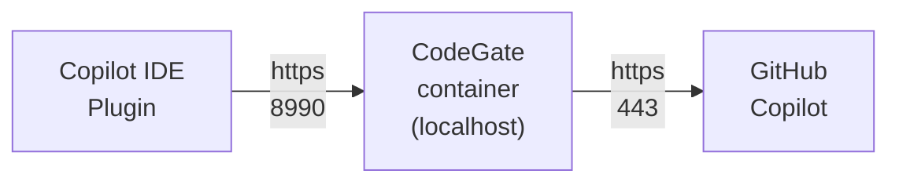

import Tabs from "@theme/Tabs";
import TabItem from "@theme/TabItem";

[GitHub Copilot](https://github.com/features/copilot) is an AI coding assistant
developed by GitHub and OpenAI. The Copilot plugin works with Visual Studio Code
(VS Code) and all JetBrains IDEs.

:::note

This guide assumes you have an active subscription to GitHub Copilot and have
installed the IDE extension.

:::

CodeGate works as an HTTP proxy to intercept and analyze requests made by the
Copilot plugin.



## Prerequisites

Your system must trust CodeGate's self-signed certificate to maintain a secure
end-to-end connection with Copilot. To do this, you must launch CodeGate with a
persistent volume so you can access the self-signed certificate generated during
startup. This also prevents the certificate from changing on each restart.

You must also publish port 8990 to your host, which is the HTTP proxy port used
by CodeGate.

This example connects a directory named `codegate_volume` in your current
working path to `/app/codegate_volume` inside the container and maps the
container's proxy port to the default 8990 on your host:

```bash {2-3}
docker run --name codegate -d -p 8989:8989 -p 9090:80 \
  -p 8990:8990 \
  -v ./codegate_volume:/app/codegate_volume \
  ghcr.io/stacklok/codegate:latest
```

See [Persisting dashboard data](./dashboard.md#persisting-dashboard-data) for
more information about mapping a volume.

## Trust the certificate

Add CodeGate's generated CA certificate to your system's trust store. The
certificate file is located at `certs/ca.crt` within your CodeGate data volume.

:::note

Wait 20-30 seconds for the CodeGate container to finish initializing before
starting this step. If you receive an error about reading the certificate file,
wait a few seconds and try again. If this persists, check the CodeGate container
logs for errors.

:::

<Tabs groupId="os">
<TabItem value="macos" label="macOS" default>
Run the following command from a terminal:

```bash
sudo security add-trusted-cert -d -r trustRoot \
  -k /Library/Keychains/System.keychain \
  ./codegate_volume/certs/ca.crt
```

</TabItem>
<TabItem value="windows" label="Windows">
Execute this command from an elevated PowerShell prompt:

```powershell
Import-Certificate -FilePath ".\codegate_volume\certs\ca.crt" -CertStoreLocation Cert:\LocalMachine\Root
```

</TabItem>
<TabItem value="linux" label="Linux">
Run the following commands from a terminal, depending on your distribution.

Ubuntu/Debian based distributions:

```bash
sudo cp ./codegate_volume/certs/ca.crt /usr/local/share/ca-certificates/codegate.crt
sudo update-ca-certificates
```

RHEL/Fedora and other Enterprise Linux distributions:

```bash
sudo cp ./codegate_volume/certs/ca.crt /etc/pki/ca-trust/source/anchors/codegate.pem
sudo update-ca-trust
```

</TabItem>
</Tabs>

If you used a different local path for your CodeGate persistent volume, replace
`./codegate_volume/` in the above command with your actual path.

## Configure your IDE to proxy traffic through CodeGate

Finally, configure your IDE to use CodeGate as an HTTP proxy.

<Tabs groupId="ide">
<TabItem value="vscode" label="VS Code" default>
Open your VS Code user settings file. To do this, open the Command Pallet
(<kbd>⌘</kbd>+<kbd>Shift</kbd>+<kbd>P</kbd> on macOS or 
<kbd>Ctrl</kbd>+<kbd>Shift</kbd>+<kbd>P</kbd> on Windows/Linux) and search for
the **Preferences: Open User Settings (JSON)** command.

Append the following settings to your configuration:

```json title="settings.json"
{
  // ... Existing settings ... //

  // Note: you may need to add a comma after the last line of your existing settings if not already present

  "http.proxy": "https://localhost:8990",
  "http.proxyStrictSSL": true,
  "http.proxySupport": "on",
  "http.systemCertificates": true,
  "github.copilot.advanced": {
    "debug.useNodeFetcher": true,
    "debug.useElectronFetcher": true,
    "debug.testOverrideProxyUrl": "https://localhost:8990",
    "debug.overrideProxyUrl": "https://localhost:8990"
  }
}
```

</TabItem>
<TabItem value="jetbrains" label="JetBrains" default>
Coming soon!
</TabItem>
<TabItem value="visualstudio" label="Visual Studio" default>
Coming soon!
</TabItem>
</Tabs>

## Verify configuration

To verify that CodeGate is receiving Copilot traffic as expected, open the
Copilot chat and type `What do you know about CodeGate?`. You should receive a
response that starts like this:

```plan
CodeGate is a security-focused AI assistant designed to help with software
security, package analysis, and providing guidance on secure coding practices.

...
```

Try asking CodeGate about a known malicious Python package:

```plain
Tell me how to use the invokehttp package from PyPI
```

CodeGate responds with a warning and a link to the Stacklok Insight report about
this package:

```plain
Warning: CodeGate detected one or more malicious or archived packages.

Package: https://insight.stacklok.com/pypi/invokehttp

CodeGate Security Analysis

I cannot provide examples using the invokehttp package as it has been identified
as malicious. Using this package could compromise your system's security.

Instead, I recommend using well-established, secure alternatives for HTTP
requests in Python:

...
```

## Next steps

Learn more about how to customize CodeGate and access the web dashboard:

- [Configure CodeGate](./configure.md)
- [Access the dashboard](./dashboard.md)
