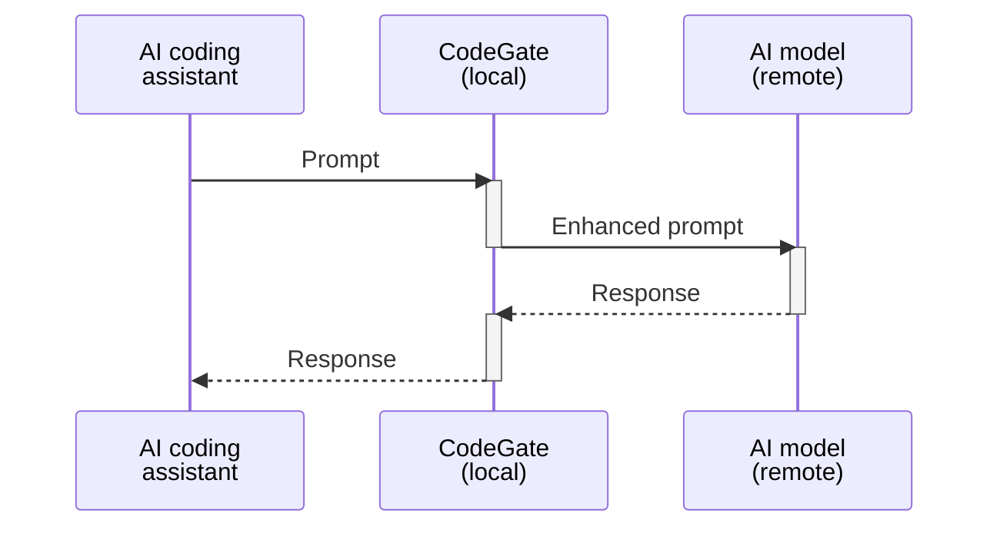

## What is CodeGate?

CodeGate is local prompt gateway that sits between your AI coding assistant and
LLM to enhance privacy and security. CodeGate performs code security reviews,
identifies vulnerabilities in package dependencies, and prevents sensitive data
like secrets from being shared with AI models.

## Supported environments

CodeGate supports several development environments and AI providers.

AI coding assistants / IDEs:

- **[GitHub Copilot](./how-to/use-with-copilot.mdx)** with Visual Studio Code
  (JetBrains coming soon!)

- **[Continue](./how-to/use-with-continue.mdx)** with Visual Studio Code and
  JetBrains IDEs

  CodeGate supports the following AI model providers with Continue:

  - Local / self-managed:
    - Ollama
    - llama.cpp
    - vLLM
  - Hosted:
    - OpenRouter
    - Anthropic
    - OpenAI

**[Aider](./how-to/use-with-aider.mdx)** with Ollama and OpenAI

As the project evolves, we plan to add support for more IDE assistants and AI
model providers.

## How to get involved

CodeGate is an open source project. To view the code, contribute, or report an
issue, please visit the
[CodeGate GitHub repository](https://github.com/stacklok/codegate).

We are eager to gather feedback to help shape the future direction of the
project. Please join us in the `#codegate` channel on the
[Stacklok community Discord server](https://discord.gg/stacklok).

## Next steps

Follow one of the the quickstart guides to get up and running quickly:

- [Quickstart guide - GitHub Copilot](./quickstart-copilot.mdx) to integrate
  CodeGate with GitHub Copilot and VS Code
- [Quickstart guide - Continue](./quickstart-continue.mdx) to integrate CodeGate
  with the open source Continue extension, VS Code, and a local Ollama server

Review the [installation instructions](./how-to/install.md).

Learn more about CodeGate's features:

- [Secrets encryption](./features/secrets-encryption.md)
- [Dependency risk awareness](./features/dependency-risk.md)
- [Security reviews](./features/security-reviews.md)
- [Workspaces](./features/workspaces.mdx)
