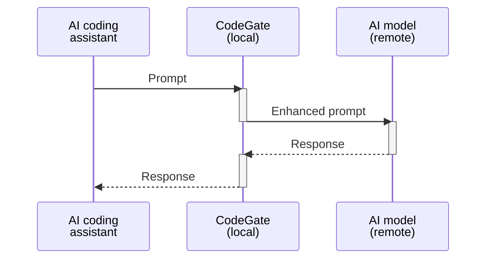

## What is CodeGate?

CodeGate is an open source local prompt gateway that works with AI coding
assistants in your IDE to enhance privacy and security. CodeGate performs code
security reviews, identifies vulnerabilities in package dependencies, and
prevents sensitive data like secrets from being shared with AI models.

## Supported environments

CodeGate supports several development environments and AI providers.

AI coding assistants / IDEs:

- GitHub Copilot with Visual Studio Code and JetBrains IDEs
- Continue.dev with Visual Studio Code and JetBrains IDEs

AI model providers:

- Ollama (locally-hosted models)
- vLLM (OpenAI-compatible mode, including OpenRouter)
- Anthropic
- OpenAI
- llama.cpp (locally-hosted models)

As the project evolves, we plan to add support for more IDE assistants and AI
model providers.

## How to get involved

CodeGate is an open source project. To view the code, contribute, or report an
issue, please visit the
[CodeGate GitHub repository](https://github.com/stacklok/codegate).

We are eager to gather feedback to help shape the future direction of the
project. Please join us in the `#codegate` channel on the
[Stacklok community Discord server](https://discord.gg/stacklok).

## Next steps

Follow the [quickstart guide](quickstart.md) to get up and running quickly using
VS Code, the Continue IDE plugin, and a local Ollama server.

Review the [installation instructions](how-to/install.md).

Learn more about CodeGate's features:

- [Secrets encryption](features/secrets-encryption.md)
- [Dependency risk awareness](features/dependency-risk.md)
- [Security reviews](features/security-reviews.md)
